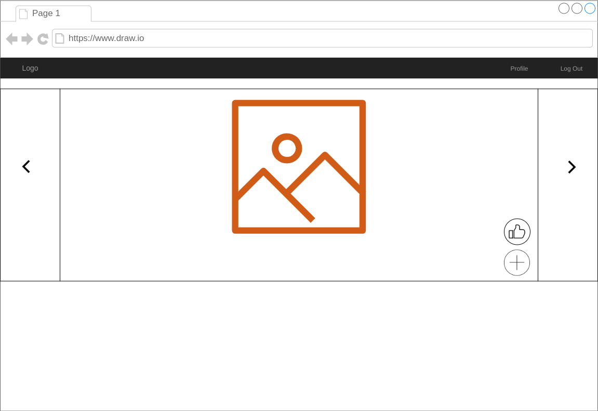

So this is turning into a bit of a series.
If you haven't read my other posts on this have a look at those first [first][1] [second][2].
As I told in my previous post I set out to build webcomponents that would expose all the functionality of each service.

We have 3 microservices 
1. [Photo Service][3]

      Right now this service doesn't have any photos just photoId, name and category.
      So I created a PR to add actual photos, as this will make the front-end a bit nicer.
      It's going to be a caurousel with the photos and a form to add new photos.

1. [Like Service][4]

      This service only adds likes for a specific photoId, so the UI for this will be simple, a "like button".
  
1. [Query Service][5]

      The query service gives you, for a specific category, the most liked photos.
      For the UI here we can build a simple list.
  
So I started implementing this following the post of [micro-frontends.org][6].
My first idea was to use react, but then I realised that I needed to wrap react components to make them webcomponents.
Instead I opted for [vuejs][7] and I must say it worked very well.
The "photo add form" I split into 2 components one to add the name and category and one to upload the actual image.
The form emits a event when the photo information has been posted then the attribute of the upload components gets this id.

```js
<template>
  <photoForm v-if="!photoId" v-on:photoId="onSubmit"></photoForm>
  <upload v-else :photoId="photoId" v-on:photoId="onSubmit"></upload>
</template>

<script>
import photoForm from "./photoForm.vue";
import upload from "./upload.vue";

export default {
  data() {
    return {
      photoId: undefined
    };
  },
  components: { photoForm, upload },
  methods: {
    onSubmit(photoId) {
      this.photoId = photoId;
    }
  }
}
</script>
```

Now that we have all these components I wanted to put them all into one site.
To fully test that this was technolgy agnostic, this project used react.
Using react with these webcomponents I needed some typescript typing:

```js
/// <reference path="@types/react" />

declare namespace JSX {
  interface LikeButtonAttributes extends React.DetailedHTMLProps<React.HTMLAttributes<HTMLElement>, HTMLElement> {
    photoId: Number;
  }
  interface IntrinsicElements {
    "photo-carousel": React.DetailedHTMLProps<React.HTMLAttributes<HTMLElement>, HTMLElement>;
    "photo-add": React.DetailedHTMLProps<React.HTMLAttributes<HTMLElement>, HTMLElement>;
    "like-button": LikeButtonAttributes;
  }
}
```
I'm going to see if I can make this a bit nicer, but now we are ready to build a page that I designed like this:


*Stay tuned for more on this!*

[1]: /2019/01/07/microservices-frontend/
[2]: /2019/11/14/microservices-frontend/
[3]: https://github.com/noseka1/photo-gallery-photo
[4]: https://github.com/noseka1/photo-gallery-like
[5]: https://github.com/noseka1/photo-gallery-query
[6]: https://micro-frontends.org/
[7]: https://vuejs.org/
