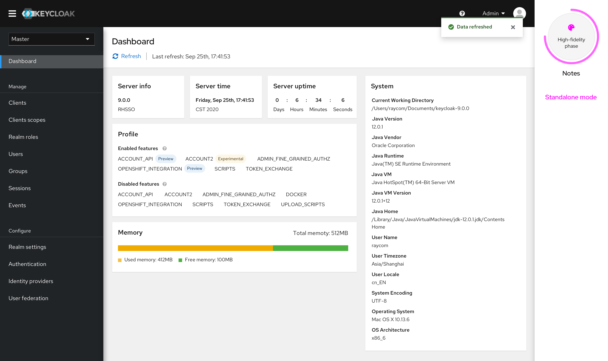
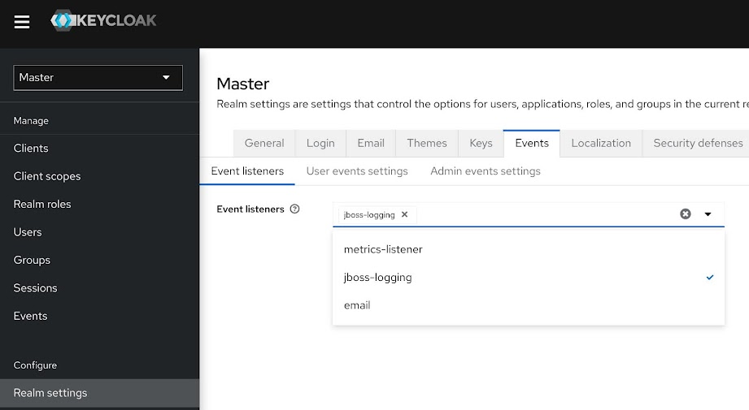
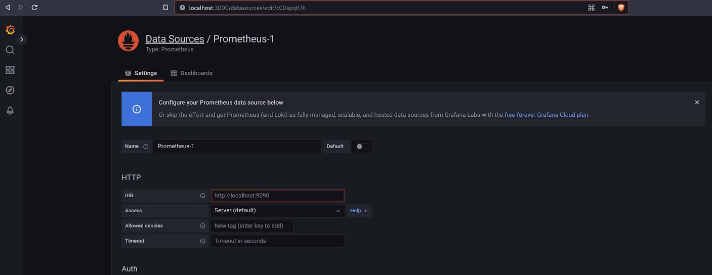
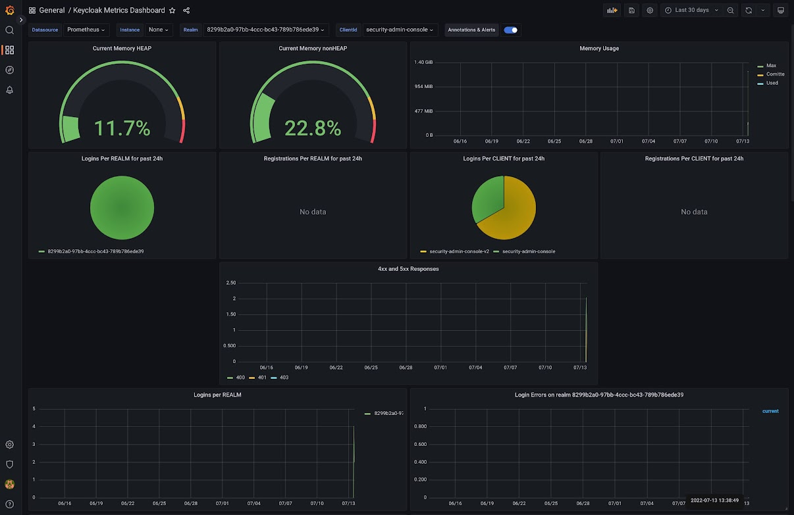

In the new design of the admin ui of keycloak we wanted to include a dashboard with some statitics, why, because dashboards are cool and they look nice 😊

We could add even more gauges and graphs of course, but why not use something that is already there like [Prometeus](https://prometheus.io) and [Grafana](https://grafana.com/).

[Aerogear](https://github.com/aerogear/keycloak-metrics-spi/) has a SPI that exposes a Pormetheus `/metrics` endpoint and a Grafana dashboard to go with it so let's install that:

```bash
cd /tmp
wget https://github.com/aerogear/keycloak-metrics-spi/releases/download/2.5.3/keycloak-metrics-spi-2.5.3.jar
```

to install it copy it into keycloak I'm using the quarkus based version:

```bash
cp /tmp/keycloak-metrics-spi-2.5.3.jar /opt/keycloak/providers/
```

restart keycloak and enable the `metrics-listener` in the admin ui: "Realm settings" -&gt; "Events", select `metrics-listener` from the dropdown



All we have to do now is install Prometeus and tell it to consume this endpoint

```bash
curl -LO https://github.com/prometheus/prometheus/releases/download/v2.19.1/prometheus-2.19.1.linux-amd64.tar.gz
tar xvf prometheus-2.19.1.linux-amd64.tar.gz
cd prometheus-2.19.1.linux-amd64
```

Then edit the `prometheus.yml` to add the keycloak endpoint

```diff
23c23,24
<   - job_name: 'Prometheus'
---
>   - job_name: 'keycloak'
>     metrics_path: '/realms/master/metrics'
29c30
<     - targets: ['localhost:9090']
---
>     - targets: ['localhost:8080']
```

[see the whole file](https://gist.github.com/edewit/0a270edc6ff43c6cfb5300a1ac857009) and start it with `./prometheus`

Install grafana and set it to use Prometheus as the data source:

```bash
wget https://dl.grafana.com/oss/release/grafana-9.0.2.linux-amd64.tar.gz
tar -zxvf grafana-9.0.2.linux-amd64.tar.gz
cd grafana-9.0.2
./bin/grafana-server
```

open `http://localhost:3000/` and login with `admin` and `admin` set Prometheus as data source `http://localhost:9090`



then import the dashboard of the aerogear/keycloak-metrics-spi "Dashboard" -&gt; "Browse" -&gt; "Import" and enter the id: `10441`

And there we have it this beautiful dashboard:


